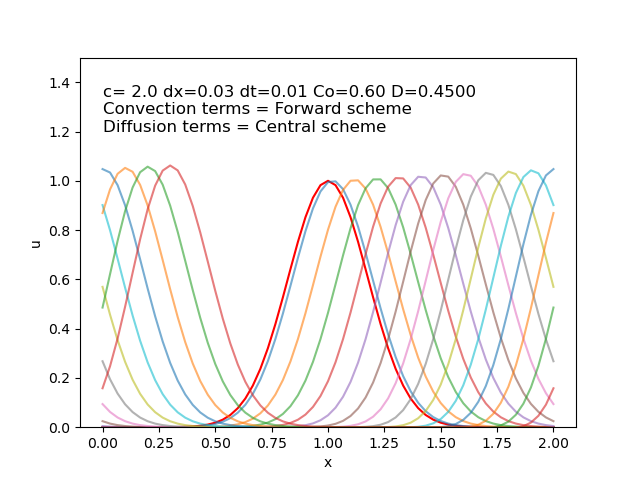
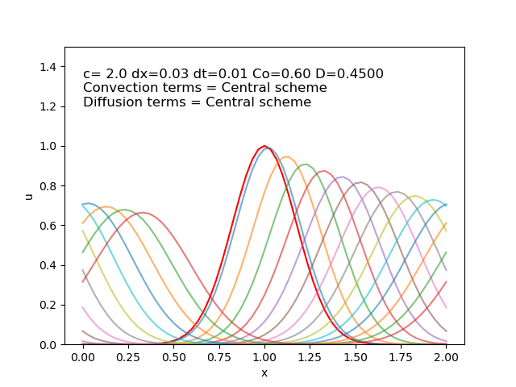
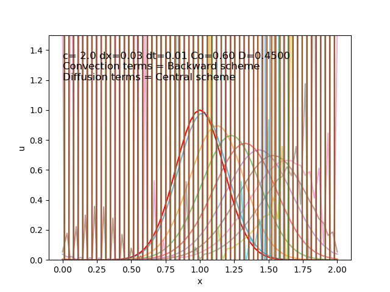
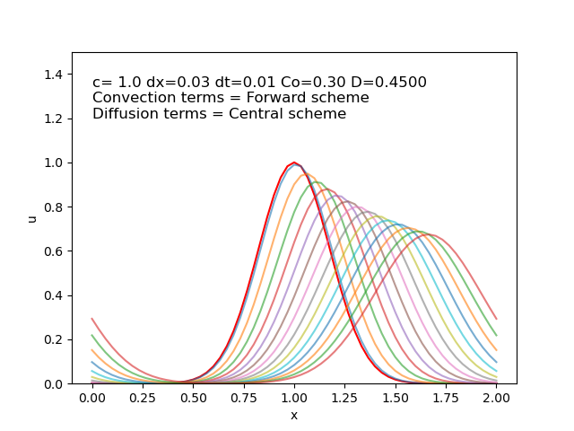
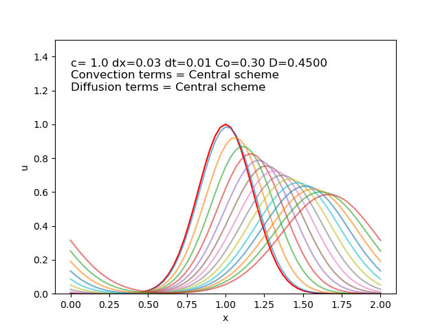
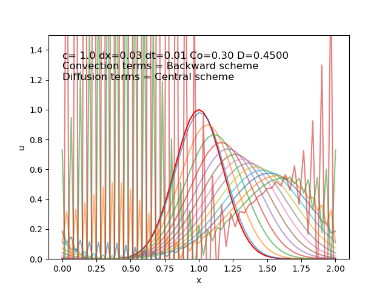

## 1D Linear Convection Diffusion

The following results present simulations of 1D Linear Convection diffuison using finite difference methods with Forward in Time , different scheme for Convection term and Central in Space fot Diffusion term.

|   |   |   |
|---|---|---|
|   |   |  |
|   |   |  |

Each plot shows the evolution of the solution over time. The red line represents the initial condition \( u(0) \), while the other lines (in varying colors) represent the solution at successive time steps.

### Observations
\[
\text{Courant Number(Co)} = \ c \cdot \frac{\Delta t}{\Delta x}
\]
\[
\text{Diffusion Number(D)} = \nu \cdot \frac{\Delta t}{\Delta x^2}
\]
Different numerical schemes applied to the convection term produced noticeably distinct behaviors.The central difference scheme yielded smooth and stable solutions across all tested cases, indicating its balanced treatment of both convective and diffusive effects under the chosen conditions. In contrast, the backward difference scheme exhibited instability in two of the test cases, likely due to a mismatch between the numerical scheme and the direction of wave propagation. The forward difference scheme, on the other hand, displayed signs of numerical anti-diffusion, where the solution became sharper instead of smoothing out—an unphysical behavior suggestive of negative numerical diffusion. These results highlight the importance of carefully selecting numerical schemes based on the direction of flow and the stability characteristics of each method.

