## 1D Linear Convection

The following results present simulations of 1D linear convection using finite difference methods. Each figure demonstrates how the choice of numerical scheme, Courant number, and velocity direction influences the behavior of the solution.

|   |   |   |
|---|---|---|
| 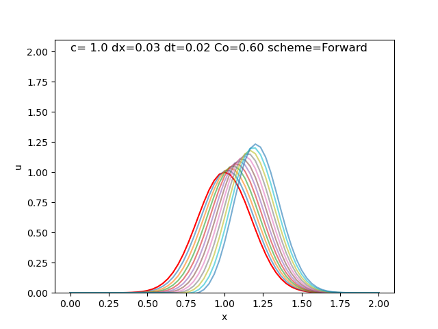  | 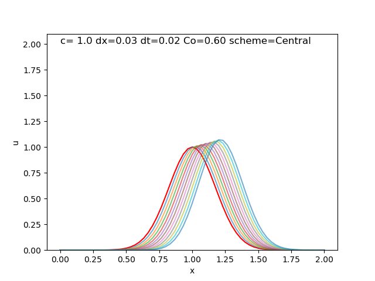  | 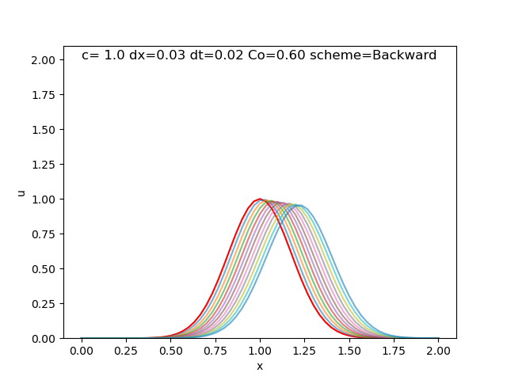 |
| 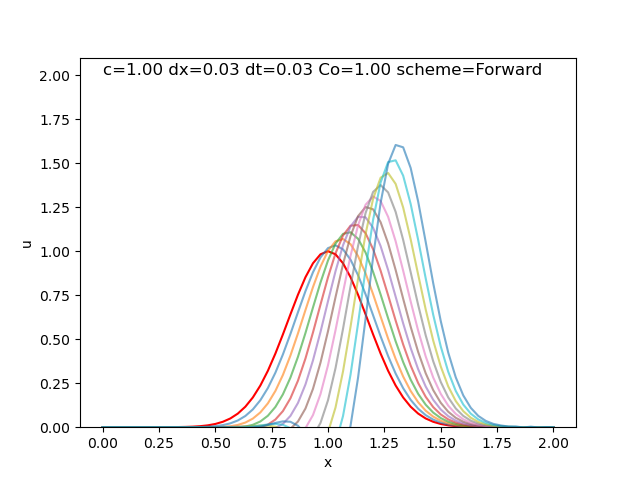  | 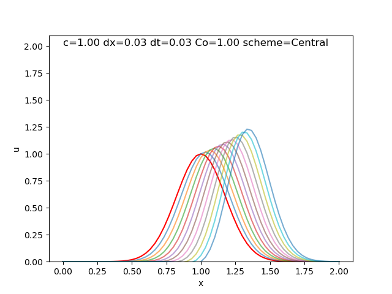  | 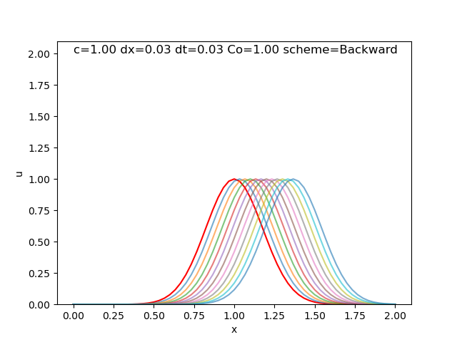  |
| 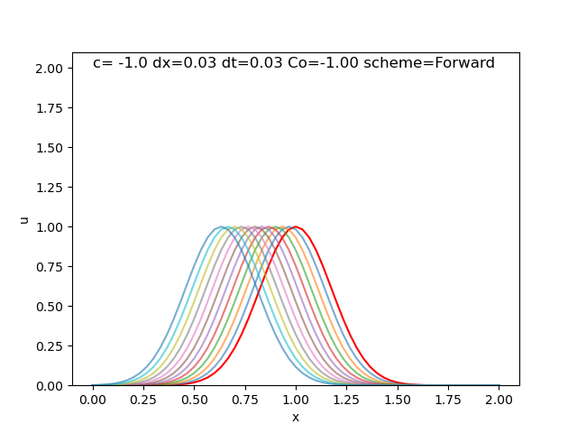  | 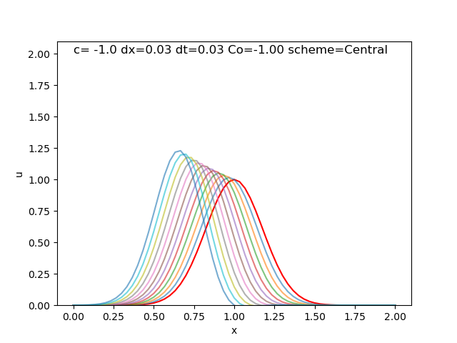  | 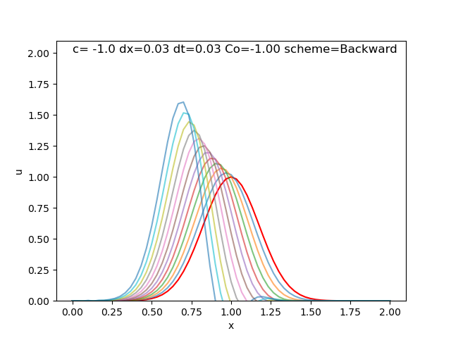  |
| 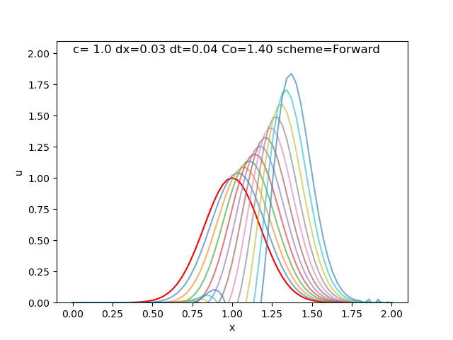 | 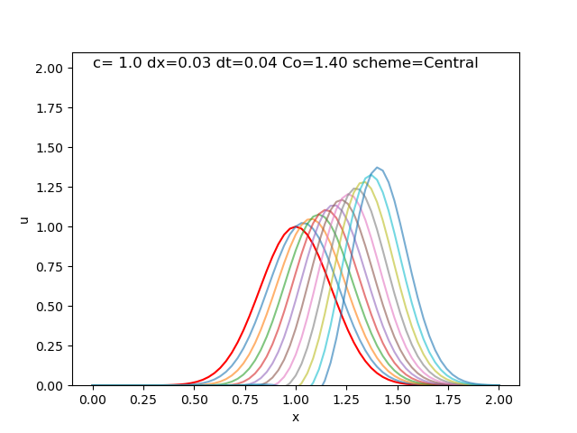 | 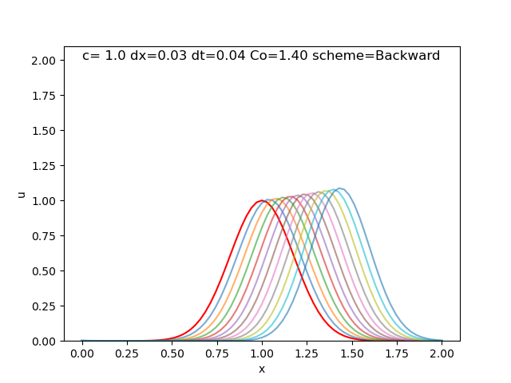 |

Each plot shows the evolution of the solution over time. The red line represents the initial condition \( u(0) \), while the other lines (in varying colors) represent the solution at successive time steps.

- **First row**: Velocity = 1, Courant number = 0.6, using different numerical schemes.
- **Second row**: Velocity = 1, Courant number = 1.0
- **Third row**: Velocity = -1, Courant number = 1.0
- **Fourth row**: Velocity = 1, Courant number = 1.4

### Observations

When the Courant number was close to 1 (\( \text{Co} \approx 1 \)), the backward difference scheme produced accurate and stable results for forward-moving waves (velocity \( c = 1 \)), while the forward difference scheme was suitable for backward-moving waves (velocity \( c = -1 \)). These configurations preserved the physical shape of the wave and exhibited minimal numerical error, reflecting the expected physical behavior of the convection process.

However, when the Courant number was less than 1 (\( \text{Co} < 1 \)), the same schemes and velocity directions continued to yield stable results, but the solutions became numerically diffusive. This diffusion resulted in artificial smoothing of the wave profile, which, although stable, deviated from the true physical behavior of the wave. The diffusion observed here is a numerical artifact and does not reflect the actual dynamics of the system.

In all other configurations, such as when the Courant number exceeded 1 or when the incorrect scheme was used relative to the wave direction, the solution became unstable. This instability often led to non-physical oscillations or complete divergence from the expected outcome, highlighting the sensitivity of the numerical method to the choice of Courant number and scheme relative to the velocity direction.
