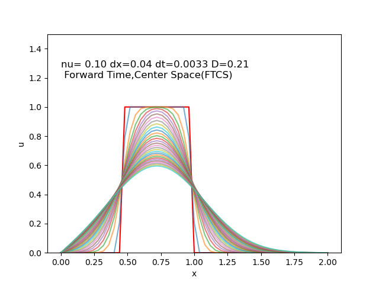
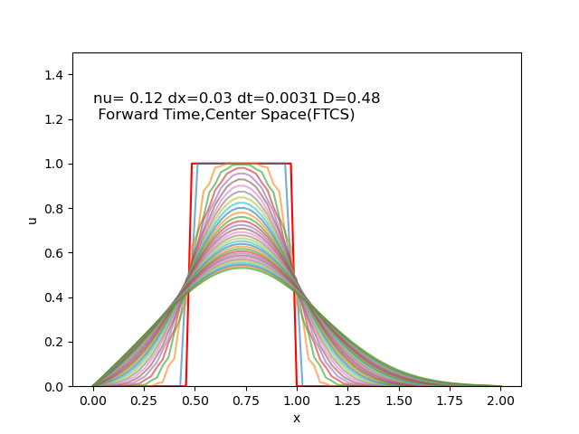
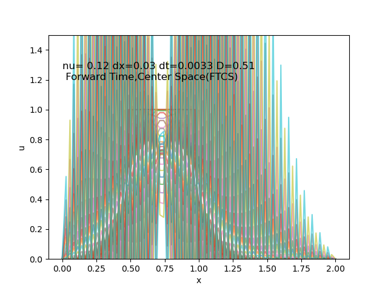

## 1D Linear Diffusion

The following results present simulations of 1D Linear diffuison using finite difference methods with Forward in Time and Central in Space (FTCS).

|   |   |
|---|---|
|   |   |
|   |   |

Each plot shows the evolution of the solution over time. The red line represents the initial condition \( u(0) \), while the other lines (in varying colors) represent the solution at successive time steps.

### Observations
\[
\text{Diffusion Number(D)} = \nu \cdot \frac{\Delta t}{\Delta x^2}
\]
In the numerical simulation of the diffusion equation using an explicit finite difference scheme, the diffusion number(D) plays a critical role in the stability of the solution. When is greater than 0.5, the solution becomes unstable, often exhibiting non-physical oscillations. In contrast, when the diffusion number is well below 0.5, the solution remains stable and smooth throughout the simulation. 

