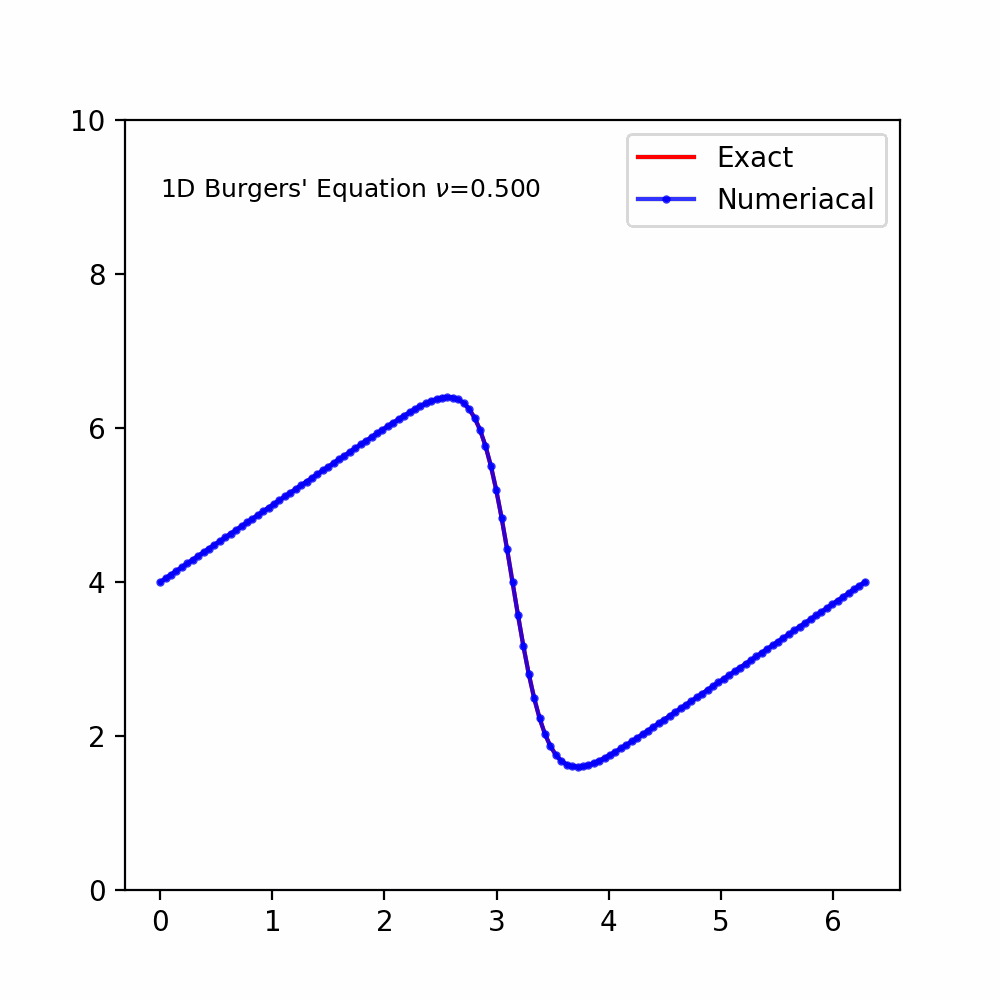
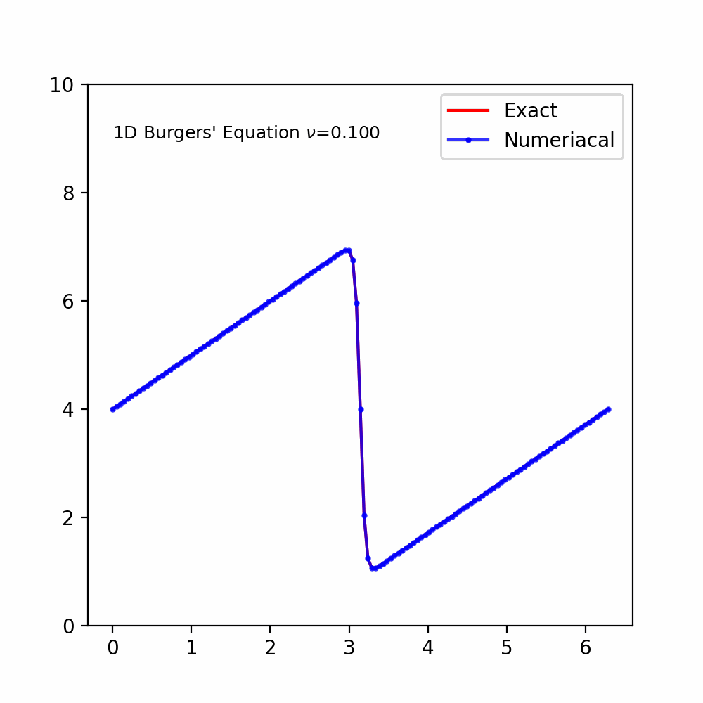
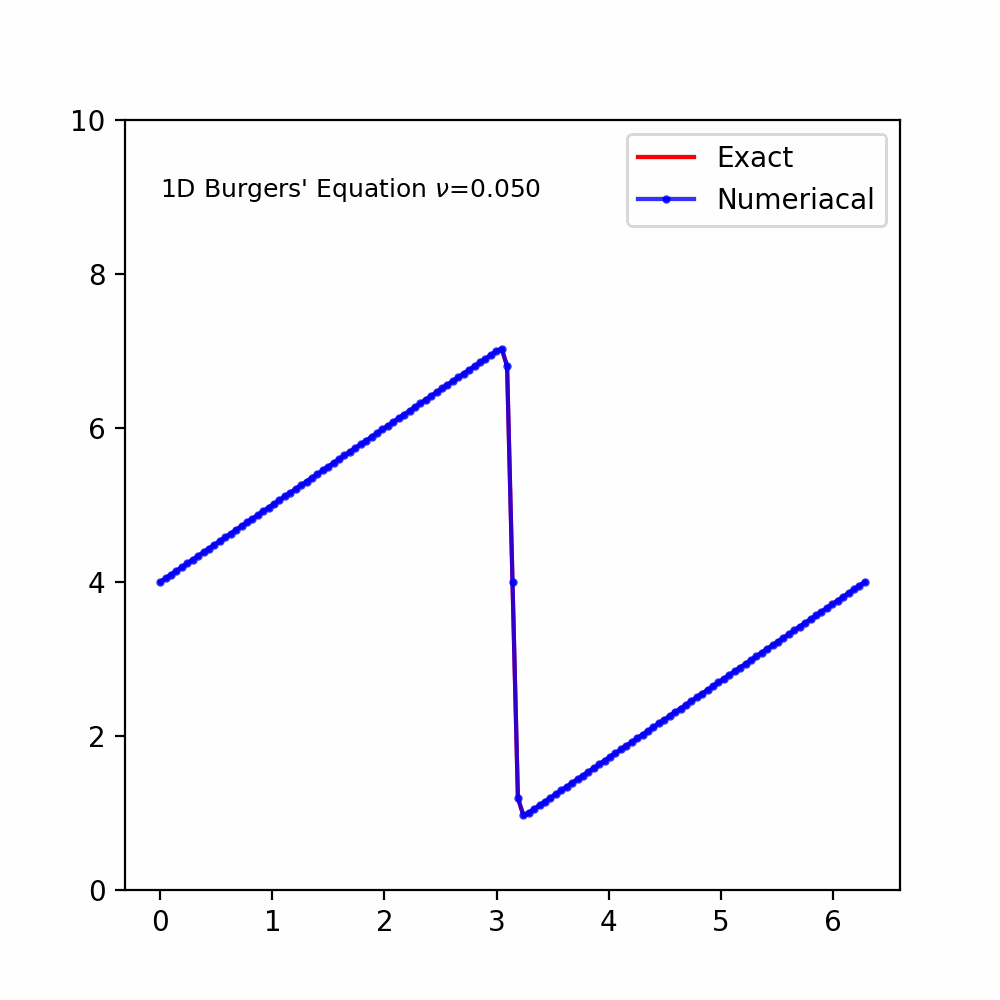
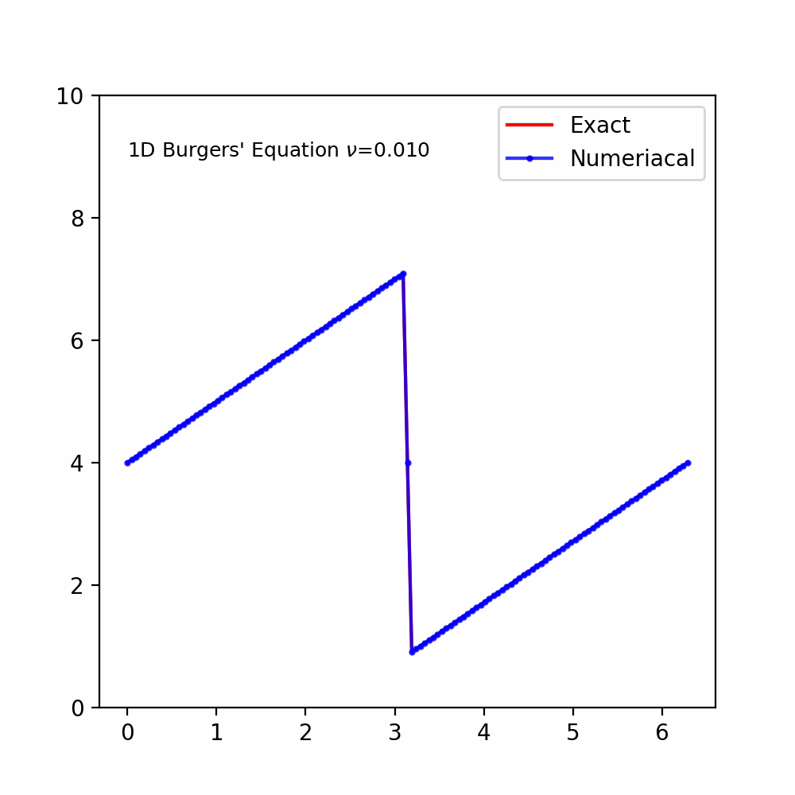
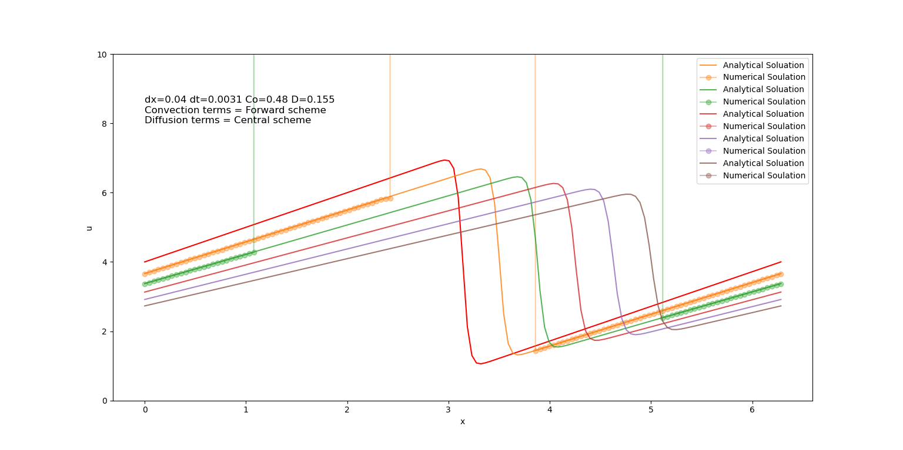
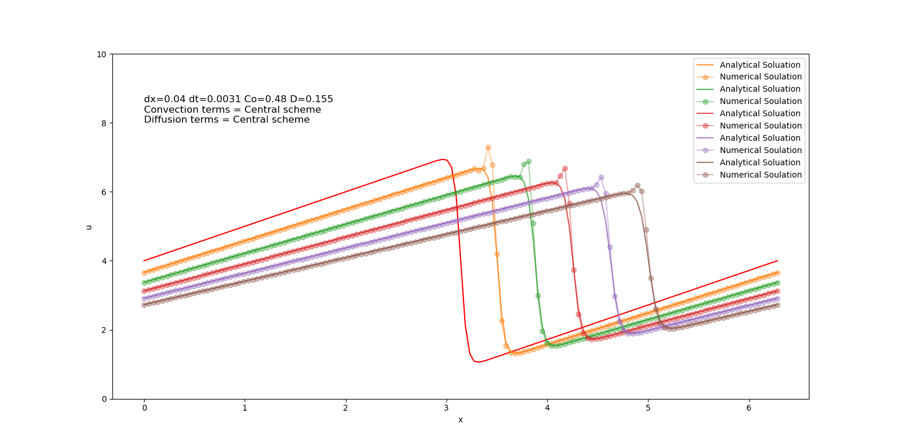
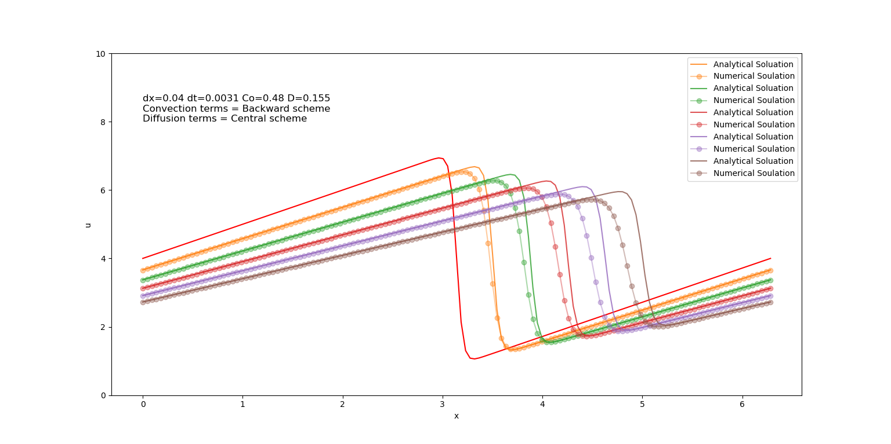
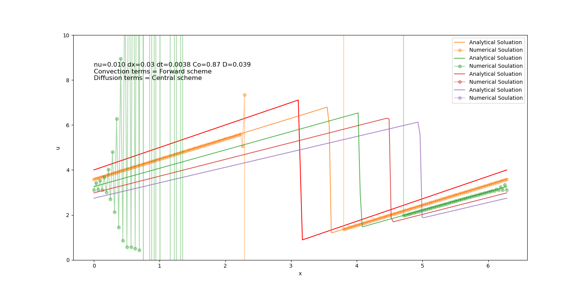
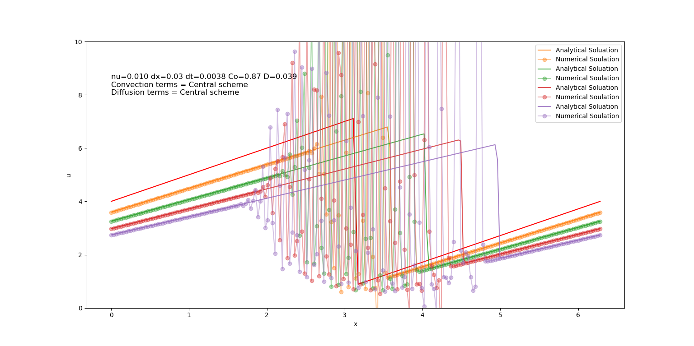

## 1D Non-Linear Convection Diffusion (Buregers' Equation)

The following results present simulations of 1D Non-Linear Convection Diffuison(Buregers' Equation) using finite difference method.For the animated visualizations (GIFs), the forward in time method was employed with the backward difference scheme for the convection term and the central difference scheme for the diffusion term. In the static plots, the same time discretization was used, while the convection term was discretized using different schemes to examine their effects. The diffusion term was consistently approximated using the central difference scheme.
|   |   |
|---|---|
|   |   |
|   |   |

|   |
|---|
|   |
|   |
|   |
|   |
|   |
|  |

Each plot shows the evolution of the solution over time. The red line represents the initial condition \( u(0) \), while the other lines (in varying colors) represent the solution at successive time steps.

