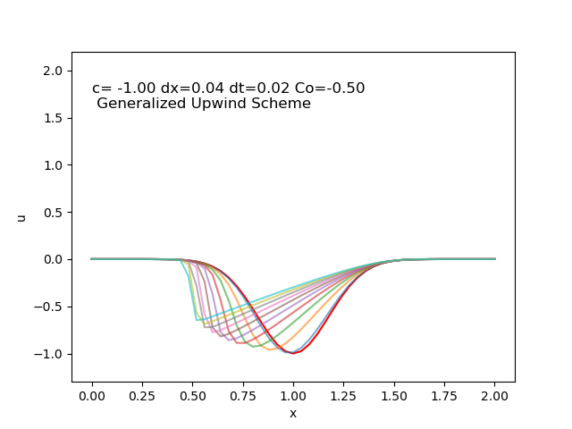

## 1D Non-Linear Convection

The following results present simulations of 1D Non-linear convection using finite difference methods with Generalized Upwind Scheme.

|   |   |
|---|---|
|   |   |
|   |   |

Each plot shows the evolution of the solution over time. The red line represents the initial condition \( u(0) \), while the other lines (in varying colors) represent the solution at successive time steps.

### Observations
When the Courant number is close to 1, the wave initially propagates with minimal numerical diffusion. However, over time, the solution gradually becomes more diffused. For Courant numbers less than 1 (e.g., Co = 0.5), the diffusive behavior becomes more pronounced and occurs more rapidly. In contrast, Courant numbers greater than 1 tend to introduce numerical instability, leading to non-physical oscillations or divergence.

Unfortunately, none of these configurations fully capture the nonlinear characteristics of the true solution. This limitation is primarily due to the first-order nature of the numerical scheme, which, while stable under certain conditions, inherently introduces excessive numerical diffusion and lacks the accuracy needed to resolve sharp gradients and nonlinear wave interactions.

