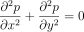
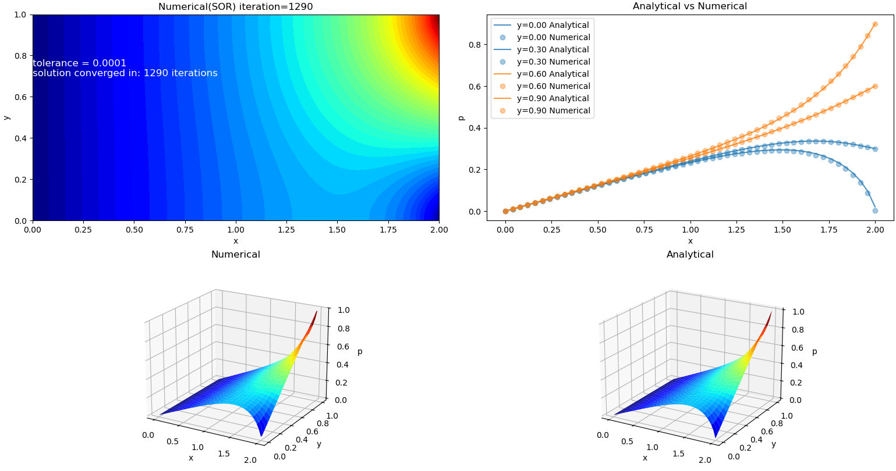

## 2D Laplace Equation

   

The following results present simulations of the 2D Laplace equation solved using iterative methods. Three different numerical approaches were employed: Jacobi, Gauss-Seidel, and Successive Over-Relaxation (SOR). Each method was implemented using finite difference discretization and the results were compared against the analytical solution. Among the three, the SOR method demonstrated the most efficient convergence, completing the calculation in approximately 1,300 iterations. The Gauss-Seidel method followed with convergence around 6,000 iterations, while the Jacobi method was the least efficient, requiring nearly 10,000 iterations to reach a similar level of accuracy. The corresponding solution plots for each method are given below. 

*2D Laplace - Jacobi (iteration=9753)*

---
*2D Laplace - Gauss-Seidel (iteration=5785)*

---
**2D Laplace - SOR (iteration=1290)**

