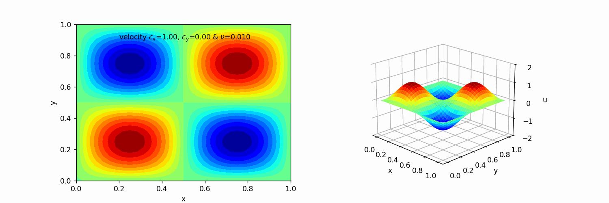
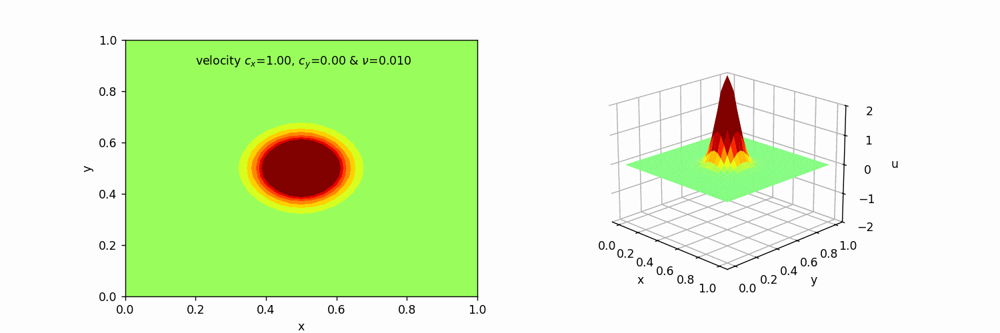
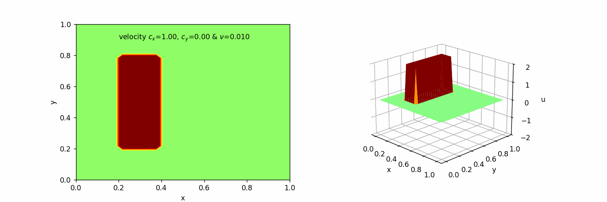

## 2D Linear Convection Diffusion

  

The following results present simulations of 2D linear convection Diffsion using the finite difference method. For the animated visualizations (GIFs), a forward-in-time discretization was applied in combination with the generalized upwind scheme for the spatial convection terms and central scheme for diffusion terms in both the x and y directions. Different initial conditions were used.

|   |
|---|
|   |
|   |
|   |

