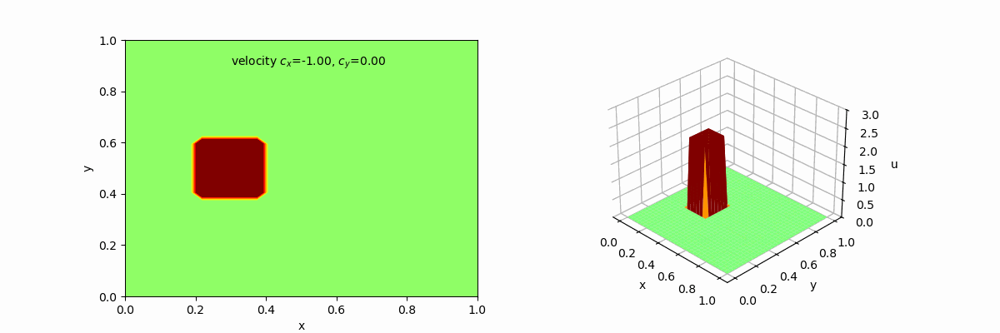
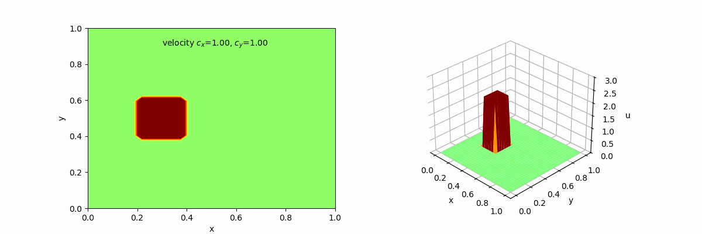
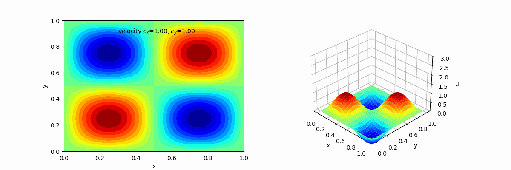

## 2D Linear Convection
$
  \frac{\partial u}{\partial t} - \ c_x  \frac{\partial u}{\partial x}- \ c_y \frac{\partial u}{\partial y} = 0
$

The following results present simulations of 2D linear convection using the finite difference method. For the animated visualizations (GIFs), a forward-in-time discretization was applied in combination with the generalized upwind scheme for the spatial convection terms in both the x and y directions. The scheme was tested for various velocity directions, including purely horizontal, vertical, and diagonal cases such as $(c_x, c_y) = (1, 0), (-1, 0), (0, 1), (0, -1)$ and $(1, 1)$. Different initial conditions were used to assess wave propagation and numerical diffusion under various flow scenarios.

|   |
|---|
|   |
|   |
|   |
|   |
|   |
|  |
|  |
|  |
|  |
|  |

## Observations
It can be observed that in cases where the wave propagates diagonally, specifically when $(c_x,c_y)=(1,1)$, numerical diffusion appears along directions perpendicular to the main propagation path. This is particularly noticeable in the results shown in the fifth and tenth GIFs. In contrast, when the wave propagates purely along the x- or y-axis, the solution remains sharp and free of visible diffusion. These results suggest that the generalized upwind scheme performs well in preserving wave sharpness along the coordinate axes, while diagonal propagation introduces some artificial diffusion due to the increased complexity of handling multidirectional flow.

