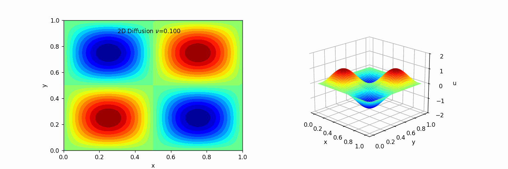
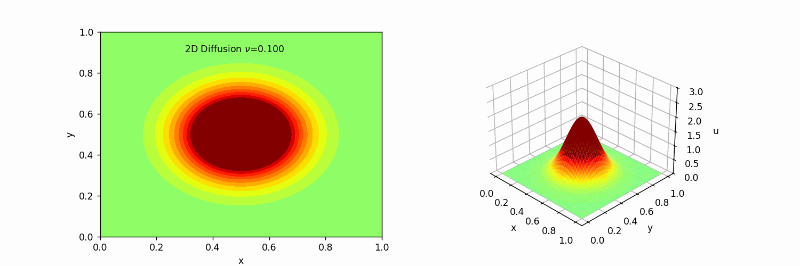

## 2D Linear Diffusion

  

The following results present simulations of 2D Non-linear convection using the finite difference method. For the animated visualizations (GIFs), a forward-in-time discretization was applied in combination with the central in space scheme for the spatial convection terms in both the x and y directions for different initial condtion. 

|   |
|---|
|   |
|   |

