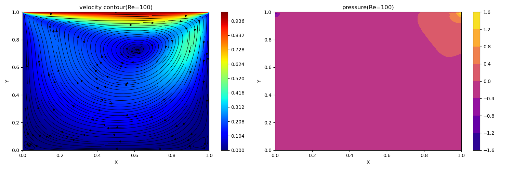
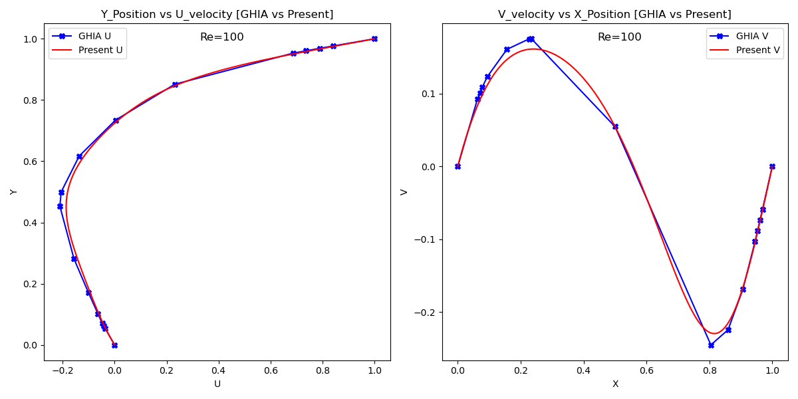
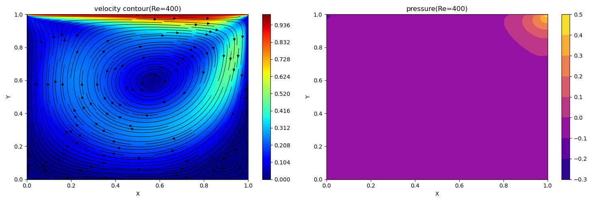
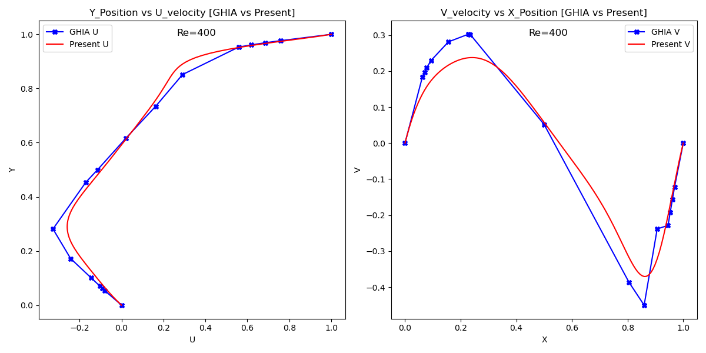
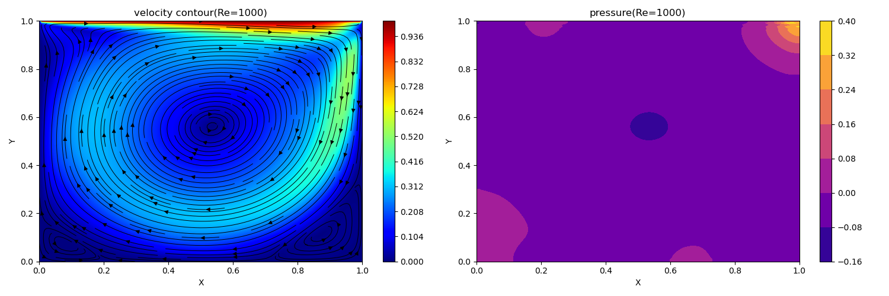
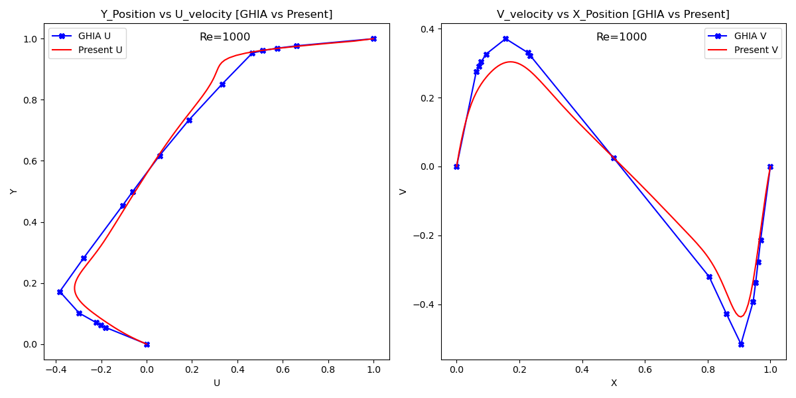
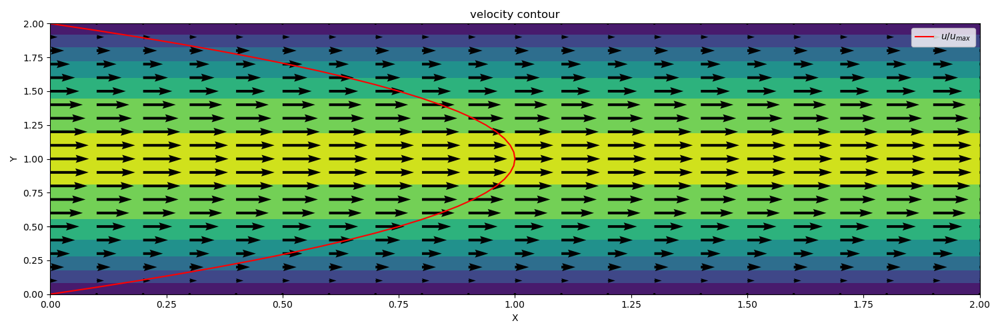
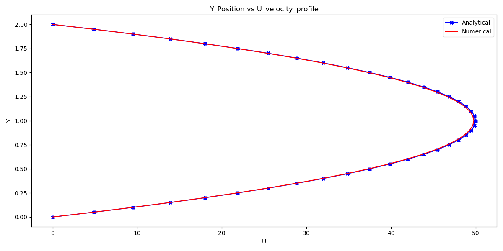

# 2D Incompressible Navier–Stokes Solver using Finite Difference Method

This project implements a 2D solver for incompressible Navier-Stokes equations using the finite difference method (FDM) and the pressure projection method. Two fundamental flow configurations are studied:

1. **Lid-driven cavity flow**  
2. **Channel flow**

The aim is to simulate these classical benchmark problems and visualize the evolution of the velocity and pressure fields. The solver is written in Python.

---

## Governing Equations

The following set of equations governs the motion of incompressible Newtonian fluids:

**Momentum equations:**

   
    

**Continuity equation:**

   

Where $u$ and $v$ are the velocity components in the  and  directions, $p$ is pressure, \(\rho\)  is fluid density, \(\nu\) is the kinematic viscosity and $F$ is the force.

---

## Numerical Method
The governing equations are discretized on a uniform Cartesian grid using second-order central differences for the diffusion terms. For the convective terms, either first-order upwind or second-order central differences are employed, depending on the desired stability and accuracy. Time integration is performed explicitly using a forward Euler scheme.

Projection method is used to enforce incompressibility. The overall procedure at each time step consists of the following steps:

 **1. Predictor step:**

   

    

Compute an intermediate velocity field \(u^*\) by solving the momentum equations without the pressure gradient term. This step accounts for convection, diffusion, and body forces.

**2. Solve a Poisson equation for pressure.**

    
    

Apply the divergence operator to the velocity correction equation and enforce the incompressibility condition or continuity equation (\(\nabla \cdot \bold u^{n+1} = 0\)) , leading to the pressure Poisson equation:  

    

    
This equation is solved iteratively using a vectorized Gauss-Seidel method.

**3. Correct the velocities using the pressure gradient.**

    

Update the velocity field by subtracting the pressure gradient.    

This procedure is repeated at each time step until the solution reaches steady state or until a specified final time is reached. Boundary conditions for velocity and pressure are tailored to each case, such as no-slip walls or periodic boundaries, and are enforced at each step of the simulation.

---

## 1. Lid-Driven Cavity Flow

### Description

In this classical benchmark problem, a square cavity is considered where the top lid moves with a constant horizontal velocity, while the remaining three walls remain stationary. The motion of the lid drives a primary vortex in the cavity, along with secondary corner vortices at higher Reynolds numbers. This test case is widely used for validating incompressible flow solvers.

### Numerical Setup

- **Spatial discretization:**  Second-order central differences for both convection and diffusion terms
- **Time integration:** Forward Euler (explicit)
- **Pressure correction:** Solved using the pressure Poisson equation with mixed boundary conditions
- **Boundary conditions:**
  - Top wall: \( u = U_{lid}=1 \), \( v = 0 \)
  - Other walls: no-slip (\( u = v = 0 \))

### Results

Velocity magnitude contours and streamlines illustrate the recirculation pattern inside the cavity.Pressure fields are shown to capture the wall-normal gradients and corner effects.Centerline velocity profiles ($u$ along vertical centerline, $v$ along horizontal centerline) are compared against the benchmark data of Ghia et al. at Reynolds numbers 100, 400, and 1000.

  
  <em>Figure 1: Velocity contour and pressure field for cavity flow at Re = 100.</em>

 

  
  <em>Figure 2: Comparison of u and v velocity profiles with Ghia et al.’s results for cavity flow at Re = 100.</em>

 

  
  <em>Figure 3: Velocity contour and pressure field for cavity flow at Re = 400.</em>

 

  
  <em>Figure 4: Comparison of u and v velocity profiles with Ghia et al.’s results for cavity flow at Re = 400.</em>

 

  
  <em>Figure 5: Velocity contour and pressure field for cavity flow at Re = 1000.</em>

 

  
  <em>Figure 6: Comparison of u and v velocity profiles with Ghia et al.’s results for cavity flow at Re = 1000.</em>

---

## 2. Channel Flow

### Description

This case simulates flow between two parallel plates under a constant pressure gradient. It approximates parabolic Poiseuille flow at steady state and is a canonical test for validating numerical solvers.

### Numerical Setup

- **Driving force:** Constant pressure gradient in the x-direction(\(F_{x}=1\))
- **Spatial discretization:**  
  -First-order upwind scheme for convection terms
  -Central differences scheme for diffusion terms
- **Time integration:** Forward Euler (explicit)
- **Pressure correction:** Solved using the pressure Poisson equation with mixed boundary conditions
- **Boundary conditions:**
  - Top and bottom walls: no-slip (\( u = v = 0 \))
  - Left and right boundaries: periodic for both velocity and pressure

### Results

Contour plots show the evolution of the flow toward a fully developed parabolic profile.The final velocity profile is compared against the analytical Poiseuille solution.

  
 <em>Figure 7: Velocity magnitude contour and horizontal velocity profile u/u_max at the channel centerline.</em>

 

  
  <em>Figure 8: Comparison of computed velocity profile with the analytical parabolic solution for fully developed channel flow..</em>

---

## Discussion

The numerical solver developed here is based on an explicit fractional step method and performs reasonably well for benchmark problems like lid-driven cavity flow and channel flow. However, several important observations and limitations were noted during simulation:

- **Explicit Time Integration:**
The use of forward Euler time stepping makes the method conditionally stable. This limits the time step size according to the CFL condition, especially at higher Reynolds numbers, requiring finer temporal resolution for stability.
- **Convection Scheme Performance:** 
Central differencing was employed for the convective terms in the cavity flow, while upwind differencing was used for the channel flow. This choice was empirical:
   - In the cavity case, where the flow is confined and recirculating, central differencing provided sufficient stability and accuracy, capturing the internal vortices effectively.
    - In the channel flow, where the velocity gradient is steep near walls and the flow is driven along a dominant direction, upwind differencing offered better numerical stability and avoided oscillations, particularly in the transient phase.
- **Pressure Correction and Divergence:**
Although a projection method is applied to enforce incompressibility, the resulting velocity field is not strictly divergence-free due to the approximate nature of the pressure Poisson solver and the explicit formulation. This deviation becomes more noticeable for coarser grids or looser convergence criteria.
- **Boundary Conditions and Geometry:**
The solver is tailored to rectangular domains with simple boundary conditions (Dirichlet or periodic). It is not designed for handling complex geometries or dynamic boundaries, which limits its applicability to more general CFD problems.

- **No Turbulence or Viscosity Variations:**
The current model assumes constant viscosity and no turbulence modeling. For higher Reynolds number flows or transitional regimes, the accuracy of the results may degrade. Additional modeling (e.g., LES, DNS, or RANS) would be necessary for such flows.

---

