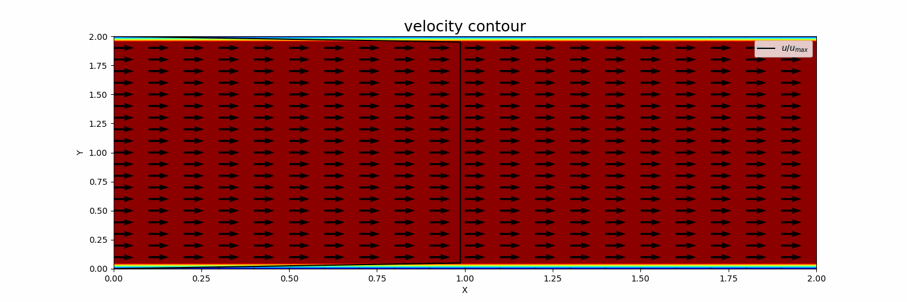

# Basic CFD Python

This repository contains a collection of small CFD projects, built using Python and finite difference methods. It ranges from 1D convection and diffusion to 2D incompressible Navier–Stokes simulations.

The goal of this work is to learn and understand the basic structure behind numerical simulations — how they are set up from scratch, how the discretization works, and how these abstract equations translate into real, observable behavior. These are not just mathematical formulas, but physical phenomena, and this project is my attempt to feel the physics through the equations.

### 1. 1D Linear Convection

  
   
  

---
### 2. 1D Diffusion

  
   
  

---

### 3. 1D Linear Convection Diffusion

  
   
  

---

### 4. 1D Nonlinear Convection

  
   
  

---

### 5. 1D Nonlinear Convection Diffusion (Burgers'    Equation)

  
   
  

---

### 6. 2D Linear Convection

  
   
  

---
### 7. 2D Diffusion

  
   
  

---

### 8. 2D Linear Convection Diffusion

  
   
  

---

### 9. 2D Nonlinear Convection Diffusion (Burgers' Equation)

  
    
  
    
  

---

### 10. 2D Navier–Stokes

  
    
  
    
  
    

-  **Cavity Flow**

  
| Re = 100 | Re = 400 | Re = 1000 |
|---------|----------|-----------|
|  |  |  |

- **Channel Flow**

  

---

## Acknowledgments

Much of my understanding came from exploring open resources and excellent online tutorials. I want to thank the following creators whose work helped me build this project:

- [Prof. Saad’s CFD YouTube Playlist](https://youtube.com/playlist?list=PLEaLl6Sf-KICvBLrYFwt5h_LgedJyN59n&si=V7piyexvp5y9BUfY)
- [Zhengtao Gan's Course on CFD](https://drzgan.github.io/Python_CFD/intro.html)
- Various insightful videos and tutorials on finite difference methods and numerical physics

I used their ideas to learn the concepts, then implemented the code myself.

---

## License

This project is licensed under the [MIT License](LICENSE).
